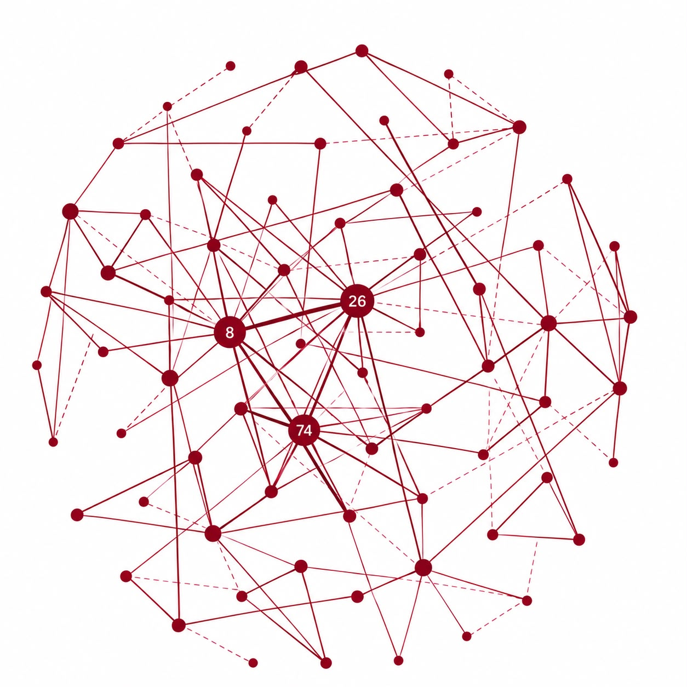

# Rural Sociology and Educational Psychology

**Name:** Asmitha R L
**Course Code:** AEXAC101  
**Course Title:** Rural Sociology and Educational Psychology  

---

**Exploring Social Capital and Leadership Structures in Rural Sociology 🌐📊**

As part of my AEXAC101 Rural Sociology assignment, I analyzed network relationships and structural centrality within rural community structures using force-directed graph visualization.

Key insights from the network analysis:

**Central Hubs**: Nodes 8, 26, and 74 emerge as key opinion leaders and primary connectors within the network, exhibiting high degree centrality.

**Information Flow**: The dense cluster surrounding these core nodes highlights how socio-economic information and innovation diffuse through key leadership channels.

**Community Cohesion**: Peripheral nodes demonstrate strong sub-group connectivity, emphasizing the importance of informal social ties in community resilience.
Visualizing these relationship dynamics provides a data-driven perspective on how social capital shapes rural development and decision-making processes.

#RuralSociology #DataVisualization #NetworkAnalysis #SocialCapital #Leadership #Kumu #AcademicProject #AgriculturalExtension
